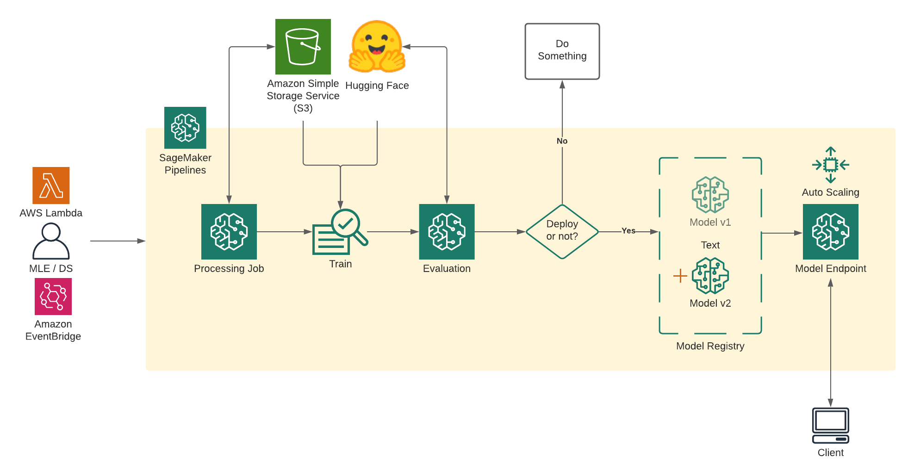

# huggingface_sagemaker_pipeline

Your custom Huggingface model for MLOps pipeline in sagemaker.

# Overview


# Pipeline


# Prepare

1. Preprocess dockerfile
2. Inference dockerfile(cpu or cuda) [sagemaker-pytorch-inference-toolkit](https://github.com/aws/sagemaker-pytorch-inference-toolkit)
3. Python Script (train.py, evaluation.py, inference.py)

# Sagemaker Notebook
[Sagemaker_pipeline](https://github.com/philschmid/huggingface-sagemaker-workshop-series/blob/main/workshop_3_mlops/lab_1_sagemaker_pipeline.ipynb)

# Sagemaker Environment variables
[Environment variables](https://github.com/aws/sagemaker-training-toolkit/blob/master/ENVIRONMENT_VARIABLES.md)

# Some tips (To understand the path)

## in ProcessingStep

* inputs (List type)
```
source(S3) -> destination(container instance)
```
* outputs (List type)
```
source(container instance) -> destination(S3)
```
## in TrainingStep

* inputs (Dict type)

Only suport train, test variables
```
source(Your sagemaker S3 URI, made at the processing step) -> destination(container instance)
```
Also, When the save the model, Use it trainer.save_model(os.environ["SM_MODEL_DIR"])

then you can check the model saved at sagemaker s3

# Custom script processing step
```python
from sagemaker.processing import ScriptProcessor

processing_output_destination = 'YOUR S3 PATH'

custom_processor = ScriptProcessor(
    image_uri='YOUR ECR URI',
    instance_type='ml.c5.2xlarge',
    instance_count=1,
    base_job_name=base_job_prefix + "/preprocessing",
    sagemaker_session=sagemaker_session,
    role=role,
    command = ["python3"])

step_process = ProcessingStep(
    name="ProcessDataForTraining",
    cache_config=cache_config,
    processor=custom_processor,
    job_arguments=["--bucket",'hg.sage',
                   "--file_name", 'train/train.csv'],
    inputs=[
        ProcessingInput(
            input_name="train.csv",
            source=f"{processing_output_destination}/train",
            destination="/opt/ml/processing/input/train"
        ),
        ProcessingInput(
            input_name="test.csv",
            source=f"{processing_output_destination}/test",
            destination="/opt/ml/processing/input/test"
        ),
    ],

    outputs=[
        ProcessingOutput(
            output_name="train",
            destination=f"{processing_output_destination}/train",
            source="/opt/ml/processing/train",
        ),
        ProcessingOutput(
            output_name="test",
            destination=f"{processing_output_destination}/test",
            source="/opt/ml/processing/test",
        ),
    ],
    code=f'{YOUR SOURCE PATH}/Preprocess.py',
)
```

# Custom script inference step

To use the custom inference, You must follow the rules.

Sagemaker inference follow the model.tar.gz

``` 
model.tar.gz
├── /code
│   └── inference.py
├── tokenizer.json
├── tokenizer_config.json
├── config.json
├── vocab.txt
└── pytorch_model.bin
``` 

[custom_inference_script](https://github.com/huggingface/notebooks/blob/main/sagemaker/17_custom_inference_script/sagemaker-notebook.ipynb)

# S3 Directory
``` 
S3
├── /code
│   └── inference.py
├── /train
│   ├── train.csv
│   ├── model.bin(optional)
│   ├── vocab.txt(optional)
│   └── config(optional)
└── /test
    └── test.csv
``` 
