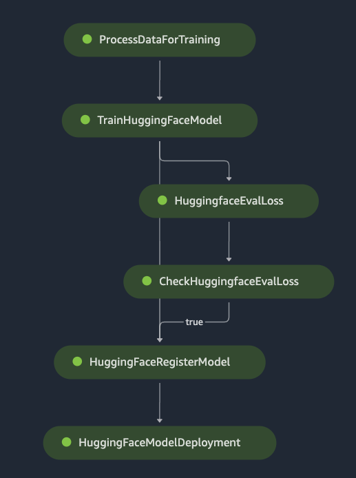

# huggingface_sagemaker_pipeline

Your custom Huggingface model for MLOps pipeline in sagemaker.

# overview

# pipeline

# Prepare

1. Preprocess dockerfile
2. Inference dockerfile(cpu or cuda) [sagemaker-pytorch-inference-toolkit](https://github.com/aws/sagemaker-pytorch-inference-toolkit)
3. Python Script (train.py, evaluation.py, inference.py)

# Sagemaker Notebook
[Sagemaker_pipeline](https://github.com/philschmid/huggingface-sagemaker-workshop-series/blob/main/workshop_3_mlops/lab_1_sagemaker_pipeline.ipynb)

